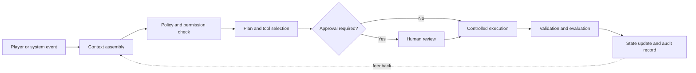

# AI Agent Orchestration for Live Gaming Systems

Status: Public conceptual explainer — not a claim that every described capability is currently available in NewGPI

**Summary:** This guide presents a practical reference model for coordinating AI agents, tools, cloud workloads and human approvals in live gaming systems.

**Topics:** AI agent orchestration, gaming infrastructure, cloud execution, permissions, human-in-the-loop systems, observability, reliability and responsible AI.

## Why orchestration matters

An AI agent can generate dialogue, recommend a quest, classify an event or coordinate a workflow. A live gaming system has a harder responsibility: it must decide which actions are permitted, execute them reliably and preserve enough evidence to explain what happened.

That responsibility belongs to the orchestration layer.

Good orchestration is not simply a model calling tools. It is a controlled process that connects player context, policies, approved capabilities, cloud execution, validation and audit records.

A production workflow should be able to answer:

1. What objective was requested?
2. Which agent or service made each decision?
3. Which tools and data were permitted?
4. What required validation or human approval?
5. What actually executed?
6. How was the outcome evaluated?
7. What evidence remains for debugging or review?

## A practical orchestration loop

Each transition is a boundary. Boundaries are where teams should define contracts, permissions, timeouts, retries and evidence.

## Seven stages of a reliable workflow

### 1. Capture a clear event

The workflow begins with a player action, game-state change, scheduled operation or service request.

The event should include a stable identifier, timestamp and minimum necessary context. Avoid collecting unrelated personal data simply because it may be available.

Examples include:

- a player completes a defined mission;
- a support agent requests an account review;
- a game service detects an invalid state transition;
- a scheduled workload prepares a non-player character update.

### 2. Assemble bounded context

The agent needs enough context to make a useful decision, but not unrestricted access to every system.

Context may include:

- current game state;
- permitted player preferences;
- relevant inventory or entitlement records;
- policy rules;
- previous workflow outcomes;
- tool descriptions and limits.

Context should be versioned or traceable. When a result is disputed, teams need to know which information and rules were available at decision time.

### 3. Check policy before planning

Permissions should be evaluated before an agent selects actions.

A policy layer can determine:

- which agent may act;
- which resources it may read or modify;
- whether the action is reversible;
- maximum cost, duration or retry count;
- whether human approval is mandatory;
- which jurisdictions or account states require additional controls.

This reduces the risk of producing a valid-looking plan that the system should never execute.

### 4. Create an inspectable plan

For multi-step work, the orchestration layer should produce a structured plan rather than an opaque block of generated text.

An inspectable plan identifies:

- the intended outcome;
- ordered steps;
- approved tools;
- expected inputs and outputs;
- stop conditions;
- validation rules;
- fallback behavior.

Plans do not need to expose hidden model reasoning. They should expose operational decisions that engineers and reviewers need to understand.

### 5. Route higher-impact actions to review

Not every workflow needs human approval. Approval should match impact.

Low-impact actions, such as generating a draft description, may proceed automatically. Higher-impact actions, such as changing an entitlement, deleting player data or publishing externally, may require explicit review.

A useful approval record includes who approved the action, what was approved, when the approval occurred and whether the plan changed afterward.

### 6. Execute through controlled adapters

Agents should not receive broad infrastructure credentials. Execution should pass through narrow adapters that enforce schemas, permissions, rate limits and timeouts.

Controlled execution also needs:

- idempotency protection for repeated events;
- retries with clear limits;
- cancellation support;
- isolation between player sessions or tenants;
- safe handling of partial failure;
- confirmation before irreversible operations.

The orchestration layer coordinates work. It should not silently bypass the controls owned by underlying services.

### 7. Validate, record and learn

A successful tool call is not automatically a successful outcome.

The system should validate the resulting game state, entitlement record or generated content against the original objective and policy. It should then write an audit record containing the event, approved plan, execution result and validation status.

Evaluation data can improve future workflows, but it should not become unlimited telemetry. Retention, access and privacy rules still apply.

## What teams should measure

Useful production signals include:

- workflow completion and failure rate;
- end-to-end and per-step latency;
- approval frequency and approval delay;
- tool error and timeout rate;
- retry and duplicate-event rate;
- policy-denial rate;
- validation failure rate;
- cost per completed workflow;
- number of incidents requiring manual recovery.

Metrics explain trends. Traces explain individual workflows. Logs preserve selected operational events. Teams usually need all three, with clear privacy boundaries.

## Failure patterns to avoid

### One agent with unlimited tools

Broad permissions increase the impact of a faulty instruction, compromised context or incorrect plan. Use specialized roles and scoped adapters.

### Silent retries

Retries without idempotency can duplicate inventory updates, notifications or external actions. Every repeatable operation needs a stable request identity.

### Approval after execution

A review screen is not a control if the action has already happened. Approval must occur before the protected transition.

### Unverifiable success

“Completed” should mean the intended state was validated, not merely that a tool returned a successful status code.

### Telemetry without purpose

Collecting everything makes systems harder to govern and can increase privacy risk. Record the evidence required for reliability, security and accountability.

## A minimal production-readiness checklist

Before enabling an agent workflow for live users, confirm that:

- the event and intended outcome are clearly defined;
- context sources are approved and traceable;
- permissions are scoped to the minimum necessary access;
- plans and operational decisions are inspectable;
- higher-impact actions require appropriate approval;
- execution adapters enforce schemas, limits and timeouts;
- retries are bounded and idempotent;
- outcomes are independently validated;
- logs, metrics and traces support incident investigation;
- privacy, retention and deletion rules are documented;
- operators can pause, cancel or recover the workflow.

## How this relates to NewGPI

NewGPI publicly documents a conceptual architecture for AI-powered gaming infrastructure. In that architecture, orchestration connects experience-layer events to controlled execution, structured records and governance.

This document describes design principles and a reference workflow. Public interfaces, supported tools and product availability should be treated as unreleased unless they are documented separately as available.

## Explore NewGPI

- [Documentation Hub](README.md)
- [Platform Overview](PLATFORM_OVERVIEW.md)
- [Technical Architecture](ARCHITECTURE.md)
- [AI Gaming Asset Lifecycle](AI_GAMING_ASSET_LIFECYCLE.md)
- [Demo Guide](DEMO_GUIDE.md)
- [Public Roadmap](../ROADMAP.md)
- [Security](../SECURITY.md)
- [Privacy](../PRIVACY.md)
- [Contribution Guide](../CONTRIBUTING.md)

Official website: https://newgpi.vip

Follow project progress:

- Star this repository to support the project.
- Use **Watch** to receive documentation updates.
- Follow the official WhatsApp channel: https://whatsapp.com/channel/0029VbD5rjPL2ATtSUSXZi3s
- Suggest a future documentation topic with the repository issue template.

Do not include credentials, personal data, confidential information or private vulnerability details in public issues.
