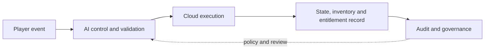

# From Game Activity to Verifiable Digital Asset Records

Status: Public conceptual explainer — not a product availability or financial-return claim

**Summary:** This article explains how AI gaming infrastructure can connect player events, AI agent controls, cloud execution, inventory and entitlement data, and governance to create records that are understandable and auditable.

**Topics:** AI gaming infrastructure, AI agents, cloud gaming, game inventory, digital assets, player entitlements, observability and responsible AI.

## The core idea

AI-powered games can create missions, rewards, inventories and adaptive experiences at enormous speed. The difficult part is not generating one more game action. It is making every important action understandable, permissioned and traceable across the infrastructure behind the experience.

A game event should not become a trusted asset record simply because an AI agent produced it.

Before a resource, entitlement or inventory change is recorded, the system should be able to answer five questions:

1. **What happened?**
2. **Who or what initiated it?**
3. **Was the action permitted?**
4. **How was the result validated?**
5. **Can the record be audited later?**

That turns an opaque game event into a controlled infrastructure workflow.

## The lifecycle at a glance

Each boundary should have explicit permissions, validation, observability and failure handling.

## A five-stage lifecycle

### 1. Player experience creates an event

The lifecycle begins with an observable event: completing a mission, earning an achievement, crafting an item, changing an inventory slot or reaching a defined gameplay milestone.

The experience layer should capture enough context to explain the event without exposing unnecessary personal data.

### 2. AI orchestration evaluates context

An AI agent may interpret the event, coordinate a multi-step task or recommend the next permitted action. The orchestration layer should operate within explicit boundaries rather than having unrestricted control.

Useful controls include:

- scoped permissions;
- approved tools and workflows;
- input and output validation;
- human review for higher-impact actions;
- clear failure and retry behavior.

### 3. Cloud infrastructure executes the workflow

Approved workloads move to the execution layer. This may include game-session processing, entitlement checks, inventory updates or supporting AI services.

Production infrastructure must make these workloads observable. Teams need logs, metrics and traces that explain what ran, when it ran and whether it completed correctly.

### 4. The data layer records state and entitlement

A structured record can connect the validated event to player state, inventory, permissions and entitlement lifecycle.

The record should distinguish among:

- a gameplay resource;
- an account entitlement;
- a transferable digital item, if supported;
- an operational or audit record.

These categories are not interchangeable. Their technical, legal and policy requirements may differ by product and jurisdiction.

### 5. Governance applies across every layer

Security, privacy, reliability and accountability should not be added after the workflow is built. They should apply from the initial game event through orchestration, execution and final recordkeeping.

Governance questions include:

- Which actions require human approval?
- What information is retained, and for how long?
- How are disputed or duplicated events handled?
- Who can modify an entitlement?
- What evidence is available during an audit?

## Why infrastructure matters

Without clear infrastructure, an AI-generated gaming experience can become difficult to operate or trust. Teams may be unable to explain why an asset changed, whether a task was authorized or how an error affected player state.

A well-designed system separates experience, control, execution, data and governance. This separation helps game teams evolve individual components while keeping responsibilities visible.

## Frequently asked questions

### Is every in-game resource a real-world asset?

No. A gameplay resource, account entitlement, transferable digital item and financial asset are different categories. Any external value or transferability requires explicit product rules, technical support, applicable legal review and clear user disclosures.

### Can an AI agent change player inventory automatically?

A system may support automated workflows, but permissions and validation should match the impact of the action. Higher-impact changes may require human approval, stronger identity checks or additional audit evidence.

### Why are logs and observability important?

They help teams explain what happened, diagnose failed workflows, detect duplicate events and investigate disputed state changes.

### What is NewGPI releasing today?

This repository currently documents a public conceptual architecture and technical direction. Public interfaces, supported asset behavior and availability will be documented only after approval for release.

## Explore NewGPI

- [Documentation Hub](README.md)
- [Platform Overview](PLATFORM_OVERVIEW.md)
- [Technical Architecture](ARCHITECTURE.md)
- [Public Roadmap](../ROADMAP.md)
- [Security](../SECURITY.md)
- [Privacy](../PRIVACY.md)
- [Contribution Guide](../CONTRIBUTING.md)

Official website: https://newgpi.vip

Follow project progress:

- Star this repository to support the project.
- Use **Watch** to receive documentation updates.
- Follow the official WhatsApp channel: https://whatsapp.com/channel/0029VbD5rjPL2ATtSUSXZi3s

Have a technical question about AI orchestration, cloud gaming or digital asset records? Use the documentation-topic issue template without including credentials, personal data or confidential information.
