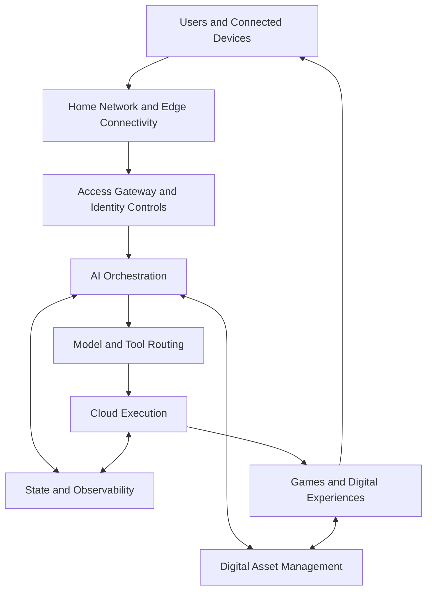

# NewGPI Technical Architecture

Status: Conceptual architecture — subject to change

The following diagram describes the public architecture model. Component names represent functional responsibilities and do not imply that every service is currently available as a public product.

## Layer responsibilities

### Users and connected devices

The interaction boundary for players, applications and smart devices.

### Home network and edge connectivity

Provides the path between real-world devices and cloud services. Future technical documentation will describe supported connectivity and performance characteristics.

### Access gateway and identity controls

Represents authentication, authorization, request validation and traffic policy responsibilities.

### AI orchestration

Coordinates agent workflows, context, policy decisions and permitted tool calls.

### Model and tool routing

Selects appropriate models or tools for an approved workflow. Provider and model support will be documented when public interfaces are released.

### Cloud execution

Runs workloads and supporting services while exposing operational health information to the observability layer.

### State and observability

Represents logging, metrics, tracing and approved state-management responsibilities. Retention and access policies will be documented with released services.

### Digital asset management

Represents structured handling of identities, permissions, entitlements and digital-value records. It does not imply investment, return or speculative financial functionality.

## Trust boundaries

Every transition between a user, gateway, orchestration service, execution environment and data system should be treated as a trust boundary. Authentication, authorization, input validation and auditability should be applied according to the risk of the operation.

## Documentation policy

Detailed deployment diagrams, data flows, endpoints and service-level objectives will be published only after they have been reviewed and approved for external release.

